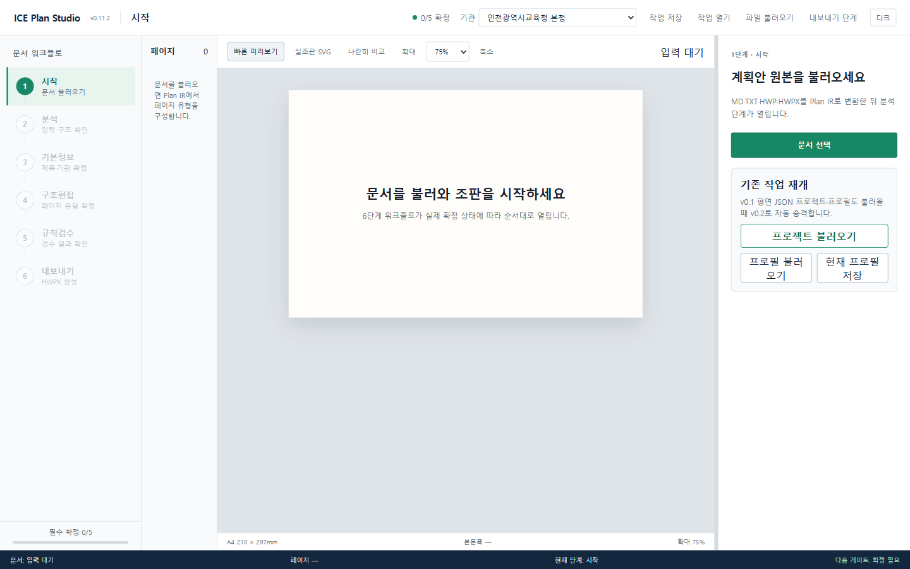
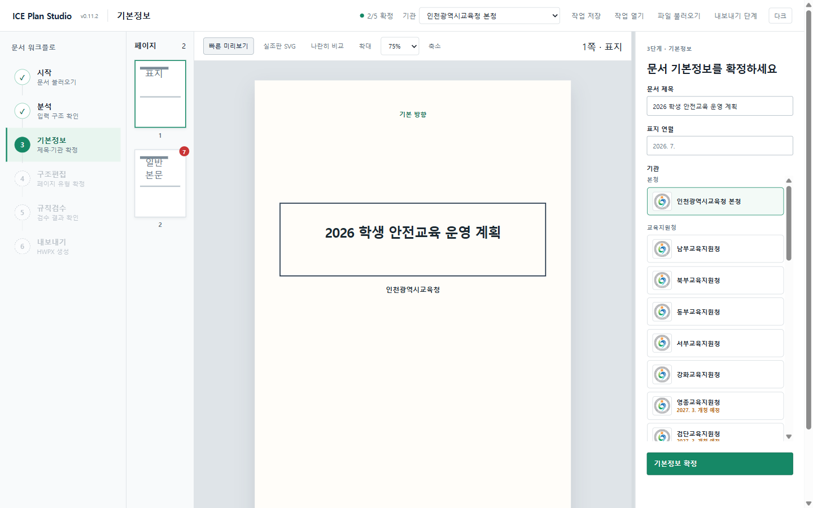
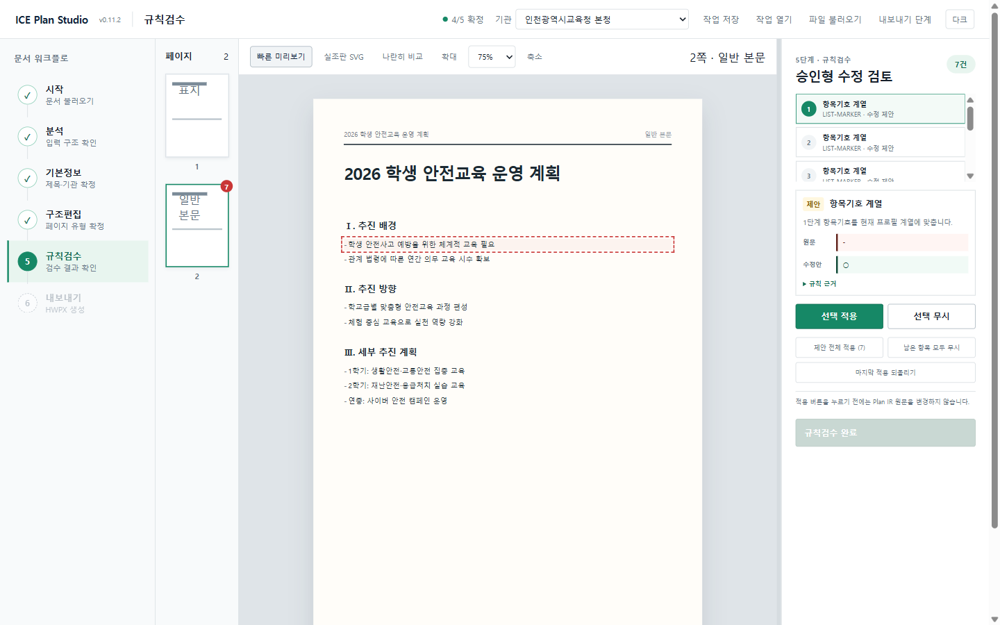
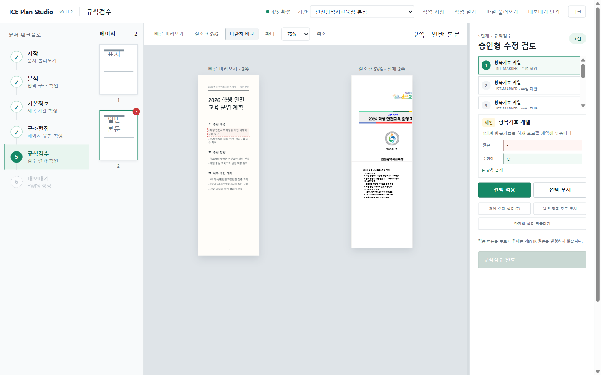
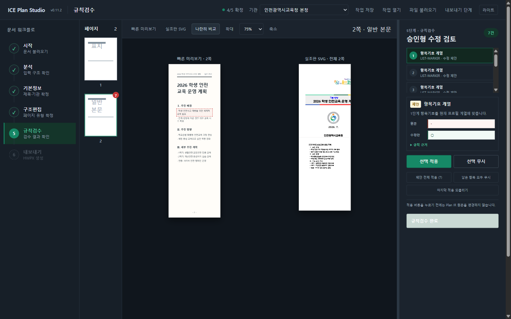

# ICE Plan Studio

인천광역시교육청 계획 문서(계획안·운영계획)를 불러와 공문서 규칙으로 검수하고,
표지·조판이 갖춰진 HWPX로 내보내는 Windows 데스크톱 앱입니다.



## 설치

1. [Releases](https://github.com/newskool4d-sketch/ice-plan-studio/releases)에서 최신
   `ICE Plan Studio Setup <버전>.exe`를 내려받아 실행합니다. 사용자 계정에 설치되며
   관리자 권한이 필요 없습니다. (무인 설치: `/S` 옵션)
2. **Python 3.11 이상**이 필요합니다 (`py` 런처 또는 PATH의 `python`).
   HWPX 변환 엔진이 사용하며, 서드파티 패키지는 필요 없습니다.
3. 설치된 버전은 앱 좌측 상단 로고 옆 배지(`v0.11.2` 등)로 확인할 수 있습니다.

## 사용 방법 — 6단계 워크플로

좌측 워크플로 레일이 진행 순서를 안내합니다. 각 단계를 **확정**해야 다음 단계가
열리며, 하단 진행률 바로 남은 확정 수를 확인할 수 있습니다.

### 1. 시작 — 문서 불러오기

- `문서 선택` 버튼으로 `.md` `.txt` `.hwp` `.hwpx` 파일을 선택하거나,
  **파일을 창에 끌어다 놓으면** 바로 불러옵니다.
- 이전에 저장한 작업(`.iceplan`)이나 기관 프로필(`.iceprofile`)도 여기서 불러옵니다.

### 2. 분석 — 입력 구조 확인

문서가 몇 개의 블록·페이지·검토 항목으로 해석됐는지 요약을 보고 확정합니다.

### 3. 기본정보 — 제목·연월·기관

문서 제목과 표지 연월을 입력하고, **기관 카드**에서 소속 기관을 선택합니다.
본청·교육지원청·직속기관·도서관 26개 기관이 등록돼 있으며, 선택한 기관명이
표지에 반영됩니다 (개청 예정 기관은 배지로 표시).



### 4. 구조편집 — 페이지 유형 확정

페이지마다 유형(표지·목차·본문·세부과제 등)을 확인·변경하고 쪽별로 확정합니다.
항목기호 계열(□·○ 등)도 여기서 선택합니다.

### 5. 규칙검수 — 승인형 수정 검토

공문서 규칙(항목기호 위계, 날짜 표기, 표 배치 등) 위반이 목록으로 뜹니다.
항목을 고르면 **원문 ↔ 수정안**이 나란히 보이고, 미리보기에서 해당 위치가
표시됩니다. `선택 적용`·`전체 적용`·`무시` 중 선택하며, **적용 버튼을 누르기
전에는 원문이 바뀌지 않습니다.** 페이지 썸네일의 빨간 배지가 남은 검토 건수입니다.



### 6. 내보내기 — HWPX 생성

저장 위치를 고르면 HWPX가 생성됩니다. 완료 후 `폴더에서 보기`로 파일 위치를
바로 열 수 있습니다.

> **분량 적응 문단 간격**: 문서가 한 쪽을 살짝 넘치거나 덜 채우면 본문 줄간격을
> 자동으로 조정해 쪽수를 맞춥니다. 조정이 일어나면 미리보기 상단 배너와 내보내기
> 알림에 **"간격 자동 조정됨"** 으로 반드시 표시됩니다 — 말없이 바뀌지 않습니다.

## 화면 구성

가운데가 A4 미리보기, 좌측이 페이지 썸네일, 우측이 단계 패널입니다.

- **미리보기 모드**: `빠른 미리보기`(즉시 반응) / `실조판 SVG`(실제 HWPX 조판) /
  `나란히 비교`(둘을 동시에)
- **패널 폭 조절**: 미리보기와 우측 패널 사이 경계선을 드래그하면 폭이 바뀝니다
  (더블클릭=기본값, 키보드 ←→로도 조절). 창 크기를 바꿔도 세 영역의 비율이 유지됩니다.
- **다크 모드**: 우측 상단 `다크` 버튼. 앱 화면만 어두워지고 A4 미리보기는
  종이 그대로 유지됩니다.




## 작업 보존

- `작업 저장` → `.iceplan` 파일 하나에 문서·진행 단계·검수 결과가 담깁니다.
  `작업 열기`로 이어서 작업합니다.
- `현재 프로필 저장` → 기관·브랜딩 설정을 `.iceprofile`로 저장해 재사용합니다.

## 지원 범위와 제한

| 구분 | 내용 |
|------|------|
| 입력 | Markdown, 텍스트, HWPX (`.hwp`는 한글에서 HWPX로 저장 후 사용) |
| 검수 | 공문서 항목기호 8단계 위계, 제목·날짜·끝 표시, 표 배치 규칙 |
| 표지 | 기관별 표지 프로필(제목틀·CI·슬로건·영문명), 기관 26곳 |
| 조판 | 표 열 너비·행 높이 자동 계산, 반복 머리글, 분량 적응 문단 간격 |
| 제한 | 최종 인쇄 품질은 한글에서 열어 확인 권장. 표지 제목이 매우 길면 CI 세로 위치가 밀릴 수 있음(개선 예정) |

## 개발자용

```bash
cd apps/desktop-prototype
npm install
npm run dev              # 브라우저 개발 모드
npm run dist:win         # 빌드 + 실물 CDP 검증 게이트(자동)
npm run dist:installer   # 검증 통과 시에만 NSIS 설치 파일 생성
```

- 회귀 게이트: `verify:plan-ir` `verify:rules` `verify:preview-equivalence` 등
  (`package.json` scripts 참조). 한글 COM 실측 게이트는 `verify:adaptive-layout`.
- 설계·검증 문서: [docs/IMPROVEMENT_PLAN.md](docs/IMPROVEMENT_PLAN.md),
  [apps/desktop-prototype/DESIGN.md](apps/desktop-prototype/DESIGN.md)
