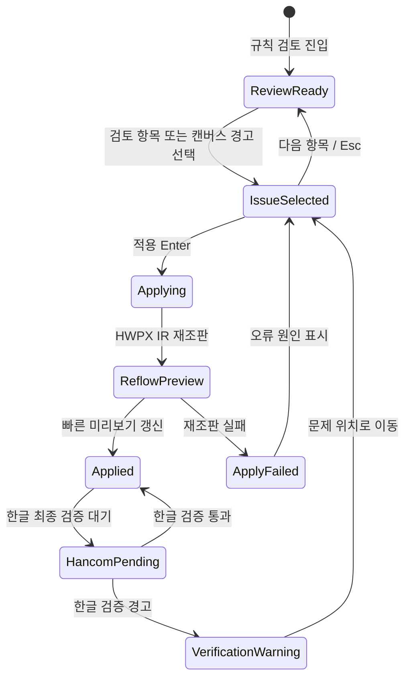

# ICE Plan Studio 규칙 검토 화면 와이어프레임

- 디자인 방향: 03 문서 캔버스형 (IBM + Miro + Technical Blueprint)
- 결정 문서: `docs/design-options/문서_캔버스형_선택_결정.md`
- 첫 구현 흐름: `규칙 검토 → 표 너비 초과 선택 → 현재값·권장값 확인 → 적용 또는 되돌리기`
- 대상: Windows 10/11 데스크톱, 100~200% 디스플레이 배율
- 문서 상태: 구현 전 와이어프레임

## 1. 설계 목표

사용자가 문서 전체를 잃지 않으면서 특정 조판 위반을 발견하고, 근거를 확인한 뒤, 한 번의 명시적 행동으로 수정하거나 되돌릴 수 있어야 한다.

이 화면의 우선순위는 다음과 같다.

1. 어느 페이지의 어떤 객체가 문제인지 즉시 보인다.
2. 현재값과 규칙값의 차이를 수치로 확인한다.
3. 수정 결과가 문서에서 어떻게 달라지는지 예측할 수 있다.
4. 적용·되돌리기·다음 검토 항목 이동이 키보드로 가능하다.
5. 문서 본문과 검토 UI의 시각적 위계가 충돌하지 않는다.

## 2. 고정 콘텐츠

| 항목 | 값 |
|---|---|
| 문서명 | `2026_읽걷쓰교육_기본계획.iceplan` |
| 현재 화면 | `규칙 검토` |
| 선택 문제 | 표 너비 초과 |
| 대상 | `추진과제 표`, 1페이지 |
| 현재값 | 164mm |
| 권장 최대값 | 160mm |
| 초과값 | 4mm |
| 적용 선택지 | 권장 최대 너비로 조정 / 내용을 조정하여 너비 유지 |
| 기본 행동 | 권장 최대 너비로 조정 |

## 3. 1440px 기본 와이어프레임

```text
┌──────────────────────────────────────────────────────────────────────────────────────────────────────────────┐
│ ICE Plan Studio │ 문서명.iceplan                    [저장됨] [한글 동기화]     도움말  설정  최소화 □ 닫기       │ 56
├───────────────┬───────────────────────────────────────────────────────────────┬───────────────────────────────┤
│ ① 시작        │ [손] [선택] [측정]  75% ▼  [한 페이지] [두 페이지] [맞춤]       │ 규칙 검토             1 / 4   │
│ ② 분석        ├───────────────────────────────────────────────────────────────┤                               │
│ ③ 메타데이터  │                         A4 문서 캔버스                          │ ① 표 너비 초과                 │
│ ④ 구조 편집   │     ┌───────────────────────────────────────────────┐          │ ─────────────────────────── │
│ ⑤ 규칙 검토   │     │  2026 읽걷쓰교육 기본 계획                       │          │ 표의 전체 너비가 본문 영역을  │
│   [선택됨]     │     │                                                   │          │ 초과했습니다.                  │
│ ⑥ 내보내기    │     │  1. 추진 방향                                     │          │                               │
│               │     │                                                   │          │ 위반 항목                     │
│               │     │  ┌──────────────────────────────────────┐         │          │ ┌───────────────────────────┐ │
│               │     │  │ 추진과제 표          ⚠ 164mm         │         │          │ │ 표 · 추진과제 표          │ │
│               │     │  │ ...                                  │         │          │ │ 페이지 1 · 표 ID TBL_01  │ │
│               │     │  └──────────────────────────────────────┘         │          │ └───────────────────────────┘ │
│               │     │                                                   │          │                               │
│               │     │  - 1 -                                            │          │ 측정값                        │
│               │     └───────────────────────────────────────────────┘          │ 현재 너비             164 mm  │
│               │          ↑ 실제 객체에 연결된 점선·번호 주석                    │ 권장 최대 너비         160 mm  │
│               │                                                               │ 초과                     4 mm  │
│               │                                                               │                               │
│               │                                                               │ 적용 방법                     │
│               │                                                               │ ◉ 권장 최대 너비로 조정       │
│               │                                                               │ ○ 내용을 조정하여 너비 유지   │
│               │                                                               │                               │
│               │                                                               │ ┌───────────┐  ┌────────────┐ │
│               │                                                               │ │ 적용 Enter │  │ 되돌리기 Esc│ │
├───────────────┴───────────────────────────────────────────────────────────────┴───────────────────────────────┤
│ 문서: 2026_읽걷쓰교육_기본계획.iceplan │ 페이지 1 / 28 │ 용지 A4 │ 본문 영역 160 × 257mm │ 검토 항목 1개 │
└──────────────────────────────────────────────────────────────────────────────────────────────────────────────┘
```

### 영역별 책임

| 영역 | 책임 | 금지 |
|---|---|---|
| 상단 앱 바 | 프로젝트·저장·한글 연동 상태 | 문서 본문 규칙과 무관한 홍보·장식 |
| 단계 레일 | 현재 단계와 완료 단계 표시 | 클릭할 수 없는 장식형 타임라인 |
| 캔버스 툴바 | 선택, 이동, 확대·축소, 페이지 보기 | 문서 내용 편집과 충돌하는 다중 도구 노출 |
| A4 캔버스 | 실제 HWPX 페이지와 객체 위치 표시 | 임의로 재작성한 유사 문서 |
| 인스펙터 | 문제 원인·수치·선택지·적용 | 원인 없는 자동 수정, 근거 없는 추천 |
| 하단 상태 바 | 페이지·용지·본문 영역·남은 검토 항목 | 오류를 색상만으로 표시 |

## 4. 1280px 대응 와이어프레임

1280px에서는 문서 캔버스의 가로 폭을 확보하기 위해 단계 레일을 축약한다.

```text
┌──────────────────────────────────────────────────────────────────────────────────────────────┐
│ 앱 바: 로고 / 문서명 / 저장·동기화 상태 / 도움말·설정                                      │
├──────┬───────────────────────────────────────────────────────────────┬───────────────────────┤
│ 아이 │ [도구] [75%] [페이지]                                           │ 규칙 인스펙터        │
│ 콘   │                  A4 캔버스                                      │ 폭 초과              │
│ 단계 │                                                               │ 현재 164 / 권장 160 │
│ 레일 │                  [선택 객체 주석]                                │ [적용] [되돌리기]    │
├──────┴───────────────────────────────────────────────────────────────┴───────────────────────┤
│ 하단 상태 바                                                                                │
└──────────────────────────────────────────────────────────────────────────────────────────────┘
```

- 단계 레일은 아이콘과 번호를 유지하고, 라벨은 hover·포커스 시 표시한다.
- 인스펙터는 최소 288px을 유지한다.
- A4 캔버스는 축소하되, 경고 객체와 인스펙터의 수치가 동시에 보이도록 한다.
- 적용 버튼은 인스펙터 하단에 고정한다.

## 5. 상태 전환



### 상태 표현 규칙

- `ReviewReady`: 검토 항목 목록과 페이지 썸네일을 표시한다.
- `IssueSelected`: 캔버스의 실제 객체와 인스펙터가 같은 번호를 공유한다.
- `Applying`: 적용 버튼을 비활성화하고 `조판 중`과 취소 가능 여부를 표시한다.
- `ReflowPreview`: 변경된 페이지와 영향을 받은 목차·페이지 번호를 갱신한다.
- `Applied`: 적용 전후 수치와 변경 취소 가능 상태를 표시한다.
- `VerificationWarning`: 빠른 미리보기와 한글 최종검증 상태를 혼동하지 않게 한다.

## 6. 인스펙터 구성

인스펙터는 스크롤하더라도 상단의 문제 요약과 하단의 기본 행동을 유지한다.

1. 문제 번호·종류·심각도
2. 한 문장 원인
3. 대상 객체 카드
4. 현재값·규칙값·차이
5. 적용 방법 라디오 그룹
6. 적용 후 미리보기
7. `적용`, `되돌리기`, `다음 항목`
8. 근거 펼침 영역: 적용된 규칙 ID와 출처

### 적용 후 미리보기

```text
현재                         권장 적용 후
┌───────────────┐            ┌───────────────┐
│ 164mm 표      │     →      │ 160mm 표      │
│ 본문 영역 초과│              │ 본문 영역 안  │
└───────────────┘            └───────────────┘
```

미리보기는 표의 실제 행·열 수를 유지하고, 축소된 도식만 보여주는 경우에도 `내용은 유지되고 열 너비만 조정됨`을 명시한다.

## 7. 페이지 썸네일

- 왼쪽 페이지 목록은 96~120px 폭의 썸네일을 사용한다.
- 현재 페이지는 2px 브랜드색 외곽선과 페이지 번호로 표시한다.
- 오류가 있는 페이지는 빨간색만 사용하지 않고 `오류 1` 텍스트 배지를 함께 표시한다.
- 썸네일 클릭은 페이지 이동만 수행하고 자동 수정은 하지 않는다.
- 썸네일이 많은 문서는 가상 스크롤을 사용하되 현재 선택 페이지가 사라지지 않게 한다.

## 8. 키보드·접근성 순서

기본 Tab 순서는 다음과 같다.

`앱 바 저장 상태 → 단계 레일 → 캔버스 도구 → 페이지 썸네일 → 선택 객체 → 인스펙터 요약 → 적용 방법 → 적용 → 되돌리기 → 다음 항목`

- `Enter`: 포커스된 항목 선택 또는 적용
- `Esc`: 인스펙터 선택 해제, 열린 팝오버 닫기, 적용 전 상태로 복귀
- `Ctrl+Z`: 마지막 적용 되돌리기
- `Ctrl+Shift+Z`: 되돌린 적용 다시 실행
- `PageUp/PageDown`: 이전·다음 검토 항목
- `Ctrl+Plus/Ctrl+Minus`: 캔버스 확대·축소
- `Ctrl+0`: 100% 또는 페이지 맞춤 기준 복귀
- 화면 낭독기: `표 너비 초과, 페이지 1, 현재 164밀리미터, 권장 160밀리미터`처럼 문제를 한 문장으로 읽는다.

## 9. 배율과 반응 규칙

| 조건 | 대응 |
|---|---|
| 1440px, 100% | 3열 전체 배치 |
| 1280px, 100% | 축약 단계 레일, 인스펙터 최소 288px |
| 1280px, 150% | 좌측 레일 서랍화, 인스펙터 유지 |
| 1024px 논리 폭 | 인스펙터를 우측 서랍으로 전환 |
| 200% 배율 | 캔버스·인스펙터를 겹치지 않게 순차 표시, 기본 행동 고정 |

문서 페이지가 좁아지는 것은 허용하지만, 표 경고·현재값·적용 버튼이 동시에 사라지는 것은 허용하지 않는다.

## 10. 첫 프로토타입 검증 시나리오

1. 규칙 검토 화면 진입
2. 페이지 썸네일에서 1페이지 선택
3. 캔버스의 점선 표 경고 선택
4. 인스펙터에서 현재 164mm와 권장 160mm 확인
5. 기본 라디오 선택을 유지한 채 `Enter`로 적용
6. 캔버스 표가 160mm로 바뀌고 페이지·목차 상태가 갱신되는지 확인
7. `Ctrl+Z`로 원상 복귀
8. `Esc`와 `PageDown`으로 다음 항목 이동
9. 1280px 및 Windows 200% 배율에서 동일 흐름 반복

## 11. 구현 전 승인 기준

- [ ] 실제 문서 객체와 캔버스 경고 번호가 일치한다.
- [ ] 인스펙터 수치와 캔버스 주석의 단위가 일치한다.
- [ ] 적용 전후의 차이를 한 화면에서 예측할 수 있다.
- [ ] 적용 실패·한글 검증 경고·되돌리기 상태가 분리된다.
- [ ] 기본 흐름을 키보드만으로 완료할 수 있다.
- [ ] 1280px·1440px·Windows 200%에서 기본 행동이 잘리지 않는다.
- [ ] 문서 본문 폰트와 앱 UI 폰트가 혼동되지 않는다.
- [ ] 장식용 색상·아이콘·주석이 추가되지 않는다.

