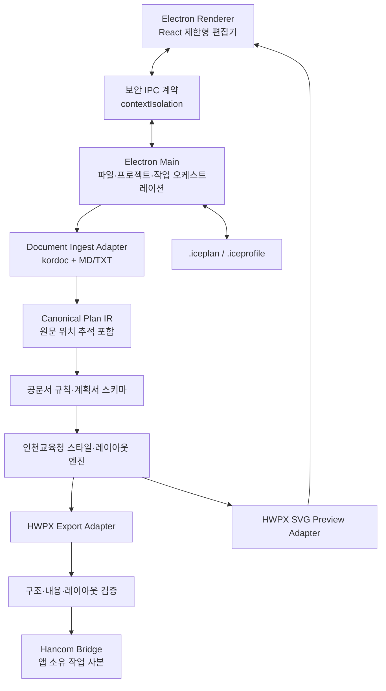

# 교육청 계획안 자동서식 GUI MVP 구현계획

| 항목 | 내용 |
|---|---|
| 문서 상태 | 구현 착수 전 확정 계획 |
| 작성 기준일 | 2026. 7. 19. |
| MVP 대상 | 인천광역시교육청 본청 계획서 첨부파일 |
| 기본 산출물 | HWPX |
| 실행 환경 | Windows 10·11 64비트 로컬 데스크톱 |
| 기본 기술 | Electron + React + TypeScript + kordoc 어댑터 |
| 핵심 원칙 | 원문 의미 보존, 원본 불변, 교육청 서식 재구성, 사용자 승인형 교정, 실제 한컴 검증 |

## 1. 계획 결론

이 MVP는 HWP·HWPX·MD·TXT에 작성된 내용을 불러와 문장, 수치, 표, 이미지와 문서 순서를 보존하면서 인천광역시교육청 본청 계획서 형식으로 다시 조립하는 Windows용 로컬 GUI 도구다.

단순한 파일 변환기가 아니라 다음 다섯 기능을 하나의 작업 흐름으로 제공한다.

1. 입력 문서의 제목 계층·본문·표·이미지 구조화
2. 공문서 작성 규칙과 계획서 구성요소 점검
3. 본청 표준형·정책브랜드형 서식 적용
4. 구조 편집·실시간 미리보기·사용자 승인형 교정
5. HWPX 생성·구조 검증·한컴오피스 실제 열기 검증

MVP는 공문에 첨부하는 계획서 본문 파일만 다룬다. K-에듀파인 기안문, 문서번호, 수신·결재·발신명의와 전자결재 연동은 후속 범위다.

## 2. 분석 근거

### 2.1 기준 문서

| 구분 | 파일 | 형식·분량 | 분석 용도 |
|---|---|---|---|
| 정책브랜드형 | `(교학과-257 ...)[붙임1] 2026 읽걷쓰교육 기본 계획.pdf` | PDF, A4, 56쪽 | 표지, 사전검토표, 요약 인포그래픽, 다색 과제 체계, 장문 본문, 일정표 |
| 표준 계획형 | `(교학과-218 ...)[붙임] 2026 인천 학생맞춤통합지원 기본 계획.hwp` | HWP 5.x | 본청 기본계획의 HWP 입력·구조 분석 대상 |
| 운영계획형 | `(교학과-220 ...)(붙임1) 2026년 인천광역시수업혁신사례연구대회 운영 계획(안내용).hwp` | HWP 5.x | 운영계획·안내용 문서와 표 중심 구성 분석 대상 |
| 표준 청색형 | `(교학과-262 ...) 2026 중등 학교생활기록부 기재 관리 기본계획.pdf` | PDF, A4, 18쪽 | 표준 청색 표지, 장 제목, 세부과제, 추진 일정표 |

두 PDF는 한컴오피스 2024에서 생성된 A4 문서다. PDF는 시각 기준으로 사용하되 HWPX의 정확한 문단·개체 속성을 모두 보존하지 않으므로, 구현 1단계에서 HWP/HWPX 원본 분석과 한컴 PDF 렌더 비교로 스타일 수치를 재확정한다.

### 2.2 확인된 시각 체계

본청 문서는 하나의 고정 디자인이 아니라 두 계열로 구분된다.

| 요소 | 표준형 | 정책브랜드형 |
|---|---|---|
| 표지 | 청색 중심 제목, CI, 기관·부서 | 정책색·문구·요약 도식 강조 |
| 본문 장 제목 | 청색 번호 상자와 제목선 | 정책색 과제 상자·섹션바 병용 |
| 본문 | 명조 계열 장문 본문 | 명조 본문과 돋움 계열 정보 블록 혼합 |
| 표 | 청색·회색 헤더, 절제된 음영 | 과제별 색상과 요약표 사용 가능 |
| 활용 | 일반 기본·운영·추진계획 | 고유 정책 BI·색상 체계가 있는 계획 |

PDF 글꼴 리소스에서 다음 글꼴군이 확인되었다.

- 제목·장 제목: HY헤드라인M 계열
- 본문: 휴먼명조·함초롬바탕 계열
- 표·설명: 한컴산뜻돋움·함초롬돋움·맑은고딕 계열
- 특수 도식: KoPub돋움·Ria Sans 등 보조 글꼴

측정된 대표 크기는 표지 약 18~26pt, 장 제목 약 15~18pt, 본문 약 14pt, 표 약 9~11pt다. 이는 PDF 렌더 리소스 기준 초깃값이며 최종 HWPX 스타일 토큰은 한컴 렌더 비교로 확정한다.

### 2.3 제공 브랜드 자산

| 파일 | 규격 | 투명도 | MVP 용도 | SHA-256 |
|---|---:|---|---|---|
| `image01.png` | 5906×1252 | 투명 배경 | 본청 슬로건 원본 | `ff36e5b8e21b4444b7717108f7d42b95f2eb88521788acfb285efabe4fb11465` |
| `image02.png` | 562×562 | 흰색 불투명 배경 | 본청 CI 기본 원본 | `2297937e160c69d716e706b5293b05b03c08b2e484bf0f770a03154b3d12ab96` |
| `image03.png` | 339×339 | 흰색 불투명 배경 | 저해상도 비교·대체 자료 | `5907085837076156f08db41fc89bef5f32577a4fae7af8c61f4564c6f944ba4f` |

기본 프로필은 `image01.png`와 고해상도 `image02.png`를 사용한다. 자르기·재색상·비율 왜곡은 금지하고, 사용자는 기관 프로필에서 자산 교체·위치·크기·여백만 조정한다.

## 3. 규칙 우선순위

규칙이 충돌할 때 다음 순서로 적용한다.

1. 현행 법령·행정안전부 행정업무운영 편람
2. 인천광역시교육청의 최신 공식 양식·브랜드 지침
3. 이 계획의 본청 스타일 프로필
4. 사용자가 선택한 프로젝트별 설정
5. 입력 파일의 기존 서식

입력 파일의 내용·사실·수치·고유명사·표 데이터는 서식보다 우선해 보존한다. 법령·공통 규칙과 기관 실제 양식이 다른 경우 규정 위반 여부와 기관 관행을 함께 표시하고 사용자에게 선택을 요구한다.

## 4. 목표와 제외 범위

### 4.1 MVP 목표

- HWP·HWPX·MD·TXT 입력을 공통 문서 구조로 변환한다.
- 표지·목차·본문·참고자료를 본청 계획서 형식으로 재구성한다.
- 표준형과 정책브랜드형 템플릿을 제공한다.
- 문단 계층, 내어쓰기, 줄간격, 자간, 장평, 쪽 나눔을 자동 조판한다.
- 표 열너비·병합·중첩·다음 쪽 넘김을 안전하게 처리한다.
- CI·슬로건을 기관 프로필에서 교체·배치할 수 있다.
- 공문서 규칙 위반은 수정 전후를 제시하고 승인된 변경만 반영한다.
- 구조 검증과 한컴오피스 실제 렌더 검증을 구분해 표시한다.
- 원본과 기존 산출물을 덮어쓰지 않는다.

### 4.2 MVP 제외 범위

- HWP 바이너리 산출
- 한컴 입력 중 매 글자 실시간 자동 서식 적용
- K-에듀파인·전자결재·문서번호 연동
- 기안문의 수신·결재·발신명의 생성
- 포토샵 수준의 CI·슬로건 내부 이미지 편집
- 한컴오피스 수준의 자유 배치·셀별 선·색 직접 편집
- 글꼴 파일 동봉
- 외부 AI·클라우드 문서 전송
- 암호·기관 DRM 우회
- 누락된 근거·예산·일정·수치의 임의 생성

## 5. 확정된 37개 제품 결정

| 번호 | 결정 |
|---:|---|
| 1 | Windows 로컬 데스크톱 GUI로 구현한다. |
| 2 | 입력은 HWP·HWPX·MD·TXT, 기본 산출물은 HWPX로 한다. HWP 산출은 후속 확장이다. |
| 3 | 입력 서식은 버리고 내용·계층·표·이미지를 추출해 교육청 템플릿으로 재구성한다. |
| 4 | 본청 표준형과 정책브랜드형 템플릿을 모두 제공한다. |
| 5 | 자동 변환 뒤 구조 검토 화면을 반드시 거친다. |
| 6 | 검토 화면은 문장·계층·순서·표 역할·이미지 위치·쪽 나눔만 편집하는 제한형 편집기다. |
| 7 | 표는 의미 기반 열너비 배분→어절 줄바꿈→허용 범위 축소→분할 제안 순으로 처리한다. |
| 8 | 여러 쪽 표는 `글자처럼 취급`을 해제하고 행 경계에서 나누며 제목행을 반복한다. |
| 9 | 제목·본문·표 글꼴을 분리하고, 필수 글꼴 누락 시 사용자 승인 없이 대체하지 않는다. |
| 10 | 표지에는 슬로건·CI·기관·부서를, 본문에는 작은 슬로건을 배치한다. 목차에는 브랜딩을 생략한다. |
| 11 | CI·슬로건은 교체·크기·위치·여백 편집이 가능하지만 이미지 내부 편집은 제외한다. |
| 12 | kordoc를 핵심 문서 엔진으로 채택하되 어댑터 뒤에 격리한다. |
| 13 | Electron + React + TypeScript를 기본 GUI 기술로 사용한다. |
| 14 | 문서 처리는 완전 로컬로 수행하고 외부 AI·클라우드 전송을 사용하지 않는다. |
| 15 | 제목·연도·문서 유형·기관·부서·템플릿·프로필·쪽 번호를 자동 추출 후 필수 확인한다. |
| 16 | 계획서 필수 구성요소를 점검하되 누락 내용을 임의 생성하지 않는다. |
| 17 | MVP는 공문에 첨부하는 기본·운영·추진계획과 계획(안)에 한정한다. |
| 18 | 공문서 규칙 위반은 수정 전후를 제시하고 승인된 변경만 적용한다. |
| 19 | 줄바꿈은 어절 보호→고립 방지→자간 -10%→장평 90%→글자 2pt 축소→경고 순으로 처리한다. |
| 20 | 앱 내부 SVG 빠른 미리보기와 한컴오피스 최종 검증을 별도로 표시한다. |
| 21 | `.iceplan` 프로젝트 파일로 편집·설정·검수 상태를 저장하고 재개한다. |
| 22 | 일반 문서만 정상 처리하고 암호·DRM은 우회하지 않으며 손상 원본을 수정하지 않는다. |
| 23 | 목차를 자동 생성하고 표지·목차를 제외한 본문부터 `- 1 -` 쪽 번호를 부여한다. |
| 24 | 일반 이미지는 비율을 유지한 문단 흐름 개체로 배치하고 복잡한 도형은 경고 후 고해상도 이미지화한다. |
| 25 | 병합 셀·중첩 표 구조를 보존하고 변환 불가 표를 몰래 이미지로 바꾸지 않는다. |
| 26 | `.iceprofile`로 기관 프로필을 가져오고 내보낸다. 상세 스타일 편집은 후속 범위다. |
| 27 | 변환·검증 이력을 프로젝트에 저장하고 HTML 보고서로 내보낼 수 있다. |
| 28 | 원본·기존 파일을 덮어쓰지 않고 검증 완료 후 버전 파일명으로 원자적 저장한다. |
| 29 | PDF는 한컴 검증이 가능한 경우에만 선택형 산출물로 제공한다. |
| 30 | Windows 10·11 64비트, 한컴오피스 2020 이상, 무관리자 설치·포터블 배포를 목표로 한다. |
| 31 | 시작·분석·기본정보·구조편집·규칙검수·내보내기의 6개 화면 흐름을 사용한다. |
| 32 | 한글 연동은 앱이 관리하는 작업 사본을 한컴에서 저장한 뒤 동기화하는 방식으로 구현한다. |
| 33 | MD 표준 문법과 TXT 공문서 항목기호·들여쓰기·UTF-8/CP949를 자동 판별한다. |
| 34 | 실행 취소·다시 실행과 자동 수정·동기화·내보내기 전 프로젝트 스냅샷을 제공한다. |
| 35 | 150쪽·100MB, 표 300개·이미지 500개를 정상 지원 목표로 한다. |
| 36 | 한국어 UI, Windows 100~200% 배율, 키보드·화면낭독기 기본 접근성을 지원한다. |
| 37 | 제공 문서 4종과 경계 사례를 필수 회귀검증 자료로 사용한다. |

## 6. 사용자 작업 흐름

한컴 연동 편집은 구조 편집 단계의 보조 경로다.

1. 앱이 프로젝트용 HWPX 작업 사본을 만든다.
2. `한글에서 편집`으로 앱이 관리하는 한컴 문서를 연다.
3. 사용자가 내용을 작성하고 저장한다.
4. `현재 내용 동기화 및 서식 적용`을 누른다.
5. 저장된 작업 사본을 다시 분석해 구조 편집 화면과 미리보기를 갱신한다.
6. 열려 있는 임의의 한글 창을 가로채거나 원본에 직접 쓰지 않는다.

## 7. 화면 구성

| 화면 | 핵심 기능 | 완료 조건 |
|---|---|---|
| 1. 시작 | 새 프로젝트, 최근 프로젝트, 파일 드래그앤드롭 | 입력 파일 또는 프로젝트 선택 |
| 2. 문서 분석 | 형식, 페이지, 표·이미지 수, 암호·손상·폰트 상태 | 처리 가능 여부 확인 |
| 3. 기본정보 | 제목, 연도·월, 문서 유형, 기관·부서, 템플릿·프로필, 쪽 번호 | 필수 메타데이터 사용자 확인 |
| 4. 구조 편집 | 목차 트리, 제한형 편집기, SVG 페이지 미리보기 | 미분류 블록·필수 오류 해소 |
| 5. 규칙 검수 | 자동 수정 후보, 누락 섹션, 표 넘침, 폰트·페이지 경고 | 필수 오류 0건, 경고 승인 |
| 6. 내보내기 | HWPX, 선택형 PDF, HTML 검증 보고서 | 최종 검증 상태와 저장 경로 표시 |
| 프로필 관리 | CI·슬로건·기관·부서·색상·배치, 가져오기·내보내기 | `.iceprofile` 검증·저장 |

구조 편집 화면은 왼쪽 목차, 가운데 편집기, 오른쪽 미리보기의 3열 구조를 기본으로 한다. 좁은 화면에서는 미리보기를 탭으로 전환한다.

## 8. 기술 아키텍처

### 8.1 런타임 구성

| 구성요소 | 책임 |
|---|---|
| Renderer | 화면과 편집 상태만 담당하며 임의 파일시스템·Node 접근을 금지한다. |
| Preload/IPC | 허용된 파일 선택·분석·저장·렌더 요청만 타입이 있는 API로 노출한다. |
| Main | 경로 검증, 작업 큐, 취소, 원자적 저장, 프로젝트 잠금, 오류 정제를 담당한다. |
| kordoc adapter | HWP/HWPX 파싱, HWPX 생성·패치·렌더 기능을 버전 독립 인터페이스로 감싼다. |
| Canonical Plan IR | 입력 형식과 관계없이 동일한 제목·문단·목록·표·이미지 구조를 유지한다. |
| Style/Layout engine | 본청 템플릿, 문단 토큰, 줄바꿈, 표 열너비, 페이지 배치를 계산한다. |
| Validator | ZIP·XML·내용·표·페이지·폰트·브랜드·한컴 검증을 단계별 실행한다. |
| Hancom Bridge | Electron 프로세스와 COM 오류를 격리하는 Windows 전용 보조 프로세스다. |

Electron 보안 기본값은 `contextIsolation: true`, `nodeIntegration: false`, 임의 웹 탐색 차단, 로컬 파일 경로 검증, 엄격한 CSP로 한다. 외부 URL이나 원격 콘텐츠를 문서 미리보기에서 실행하지 않는다.

### 8.2 kordoc 적용 원칙

- 구현 착수 시 최신 안정판을 다시 확인한 뒤 정확한 버전을 lockfile에 고정한다.
- HWP/HWPX 파싱, 공통 IR, HWPX 생성, SVG 렌더, lint·validate 기능을 우선 재사용한다.
- 인천교육청 스타일, 프로젝트 데이터, 사용자 승인 규칙은 kordoc 내부 타입에 직접 결합하지 않는다.
- kordoc API 변경은 adapter의 계약 테스트에서 차단한다.
- MIT 라이선스와 NOTICE를 설치 패키지에 포함한다.
- 기존 Python HWPX 스킬의 `validate`, `page_guard`, `verify`, `finalize` 도구는 개발·QA 독립 검증기로 사용한다. 운영 앱이 외부 Python 설치를 요구하지 않도록 필요한 검사는 TypeScript 런타임으로 구현한다.

### 8.3 한컴 연동 원칙

- 앱이 시작한 한컴 인스턴스와 작업 사본만 제어한다.
- COM 호출은 별도 Hancom Bridge에서 실행해 Electron 충돌과 비트 수 차이를 격리한다.
- 2020·2022·2024 버전별 기능 탐지 결과를 capability로 반환한다.
- 저장되지 않은 변경이 있으면 동기화하지 않고 저장을 요청한다.
- 한컴 연동 실패는 핵심 HWPX 생성 기능을 중단시키지 않는다. 다만 `한컴 검증 완료` 상태는 부여하지 않는다.
- 임의의 기존 한글 창·탭을 찾아 직접 수정하지 않는다.

## 9. 공통 문서 구조와 프로젝트 파일

### 9.1 Canonical Plan IR

각 블록은 최소한 다음 정보를 가진다.

| 필드군 | 내용 |
|---|---|
| 식별 | 안정적인 block ID, 부모 ID, 순서 |
| 원문 추적 | 입력 파일, 페이지·문단·표·셀 위치, 원문 문자열 |
| 의미 역할 | cover-title, chapter, section, body, list, note, table, image, appendix 등 |
| 계층 | 장·절·항 단계, 항목기호 종류, 내어쓰기 단계 |
| 콘텐츠 | 텍스트 run, 표 grid, 병합·중첩 정보, 이미지 참조 |
| 승인 상태 | 자동 추정 신뢰도, 사용자 확정 여부, 교정 전후 |
| 레이아웃 힌트 | keep-with-next, page-break-before, 열 역할, 캡션 관계 |

원문 보존 검사는 `sourceText`와 승인된 교정 목록을 기준으로 수행한다. 승인되지 않은 내용 변경이 발견되면 내보내기를 차단한다.

### 9.2 `.iceplan`

`.iceplan`은 ZIP 기반 단일 프로젝트 패키지로 설계한다.

- `project.json`: 프로젝트 버전, 입력 지문, 메타데이터, 상태
- `document.json`: Canonical Plan IR
- `profile/`: 적용한 기관 프로필 스냅샷
- `assets/`: 프로젝트에서 실제 사용하는 CI·슬로건·본문 이미지
- `history/`: 최근 10개 자동 스냅샷과 명시적 저장본
- `validation/`: 규칙 교정, 경고 승인, 구조·한컴 검증 결과

원본 파일은 패키지에 자동 포함하지 않고 경로와 SHA-256만 기록한다. 사용자가 이동 가능한 패키지를 만들 때만 원본 포함 여부를 별도로 선택한다.

### 9.3 `.iceprofile`

`.iceprofile`도 ZIP 기반 패키지로 설계한다.

- 기관·부서 기본값
- CI·슬로건·대표 색상
- 표지·본문별 표시 여부
- 크기, 위치, 여백, 비율 잠금
- 프로필 스키마·버전

내장 본청 프로필은 읽기 전용으로 유지한다. 편집 시 복제본을 새 이름으로 저장한다. 알 수 없는 스키마 버전, 누락 자산, 허용 범위를 벗어난 배치값은 가져오지 않는다.

## 10. 입력 처리

### 10.1 형식별 처리

| 입력 | 처리 방식 | 주요 경고 |
|---|---|---|
| HWPX | ZIP/XML 구조 파싱, 표·이미지·스타일 힌트 추출 | DRM, 손상 ZIP, 누락 파트, 오래된 조판 캐시 |
| HWP 5.x | kordoc OLE/CFB 파싱 후 공통 IR 생성 | 암호·기관 DRM, 배포용 제한, 복잡 개체 손실 |
| MD | GFM 제목·목록·표·강조·이미지와 선택형 YAML 메타데이터 파싱 | 깨진 표, 존재하지 않는 상대경로 이미지 |
| TXT | UTF-8·CP949 감지, 공문서 항목기호·들여쓰기·빈 줄로 계층 추정 | 낮은 계층 판별 신뢰도 |

### 10.2 MD·TXT 계층 규칙

- MD: `#`, `##`, `###`, 목록, 표, 이미지 문법을 우선한다.
- TXT: `Ⅰ.`, `Ⅱ.`, `1.`, `가.`, `1)`, `가)`, `□`, `○`, `-`, `※`를 탐지한다.
- 기호가 같아도 문맥·들여쓰기·전후 문단으로 제목과 목록을 구분한다.
- 불확실한 블록은 자동 확정하지 않고 검토 화면에 표시한다.
- MD 상대경로 이미지는 문서 위치를 기준으로 resolve하고 작업 폴더 밖 접근을 명시적으로 확인한다.

### 10.3 보호·손상 문서

- 암호·기관 DRM을 우회하지 않는다.
- kordoc가 로컬에서 정상 해석 가능한 배포용 문서만 읽는다.
- 해석 불가 문서는 한컴에서 일반 HWPX 사본으로 저장하도록 안내한다.
- 손상 원본에 복구 데이터를 직접 쓰지 않는다.
- 오류 로그에는 본문, 개인정보, 표 셀 값을 기록하지 않는다.

## 11. 템플릿과 조판 규칙

### 11.1 문서 기본 구조

1. 표지
2. 선택형 사업계획 사전검토표
3. 목차
4. 선택형 계획 요약
5. 추진 개요·근거·배경·목적·방침
6. 추진 체계·세부 추진 계획
7. 주요 추진 일정
8. 예산 운용 계획
9. 기대 효과
10. 참고자료·붙임

문서 유형별로 필요 여부와 명칭을 달리한다. 누락 섹션은 `추가`, `해당 없음`, `그대로 진행` 중 사용자가 선택하며 프로그램이 사실을 만들어 넣지 않는다.

### 11.2 표지·목차·머리말

- 표지 상단: `image01.png` 슬로건
- 표지 중앙: `image02.png` 본청 CI
- 표지 하단: 인천광역시교육청과 담당 부서
- 목차: 브랜딩과 쪽 번호 제외
- 본문·참고자료: 우측 상단 작은 슬로건
- 본문 쪽 번호: 중앙 하단 `- 1 -`부터 시작
- 참고자료·붙임: 본문 번호를 이어서 사용
- 목차 번호는 최종 조판 뒤 재계산하고 실제 쪽과 비교한다.

### 11.3 글꼴 정책

| 역할 | 기본 후보 | 정책 |
|---|---|---|
| 표지·장 제목 | HY헤드라인M 계열 | 설치 여부 필수 검사, 대체 시 승인 필요 |
| 본문 | 휴먼명조 또는 함초롬바탕 | 템플릿별 고정, 임의 혼용 금지 |
| 표·설명·주석 | 한컴산뜻돋움 계열 | 9~11pt 범위에서 표 역할별 토큰 사용 |
| 보조 도식 | KoPub돋움·Ria Sans 등 | 자산·템플릿에 실제 포함된 경우만 사용 |

글꼴 파일은 배포하지 않는다. 누락 글꼴이 있으면 미리보기와 한컴 결과가 달라질 수 있으므로 `본청 서식 검증 완료`로 표시하지 않는다.

### 11.4 줄바꿈·내어쓰기

1. 문단 역할에 해당하는 표준 줄간격과 문단 전후 간격을 적용한다.
2. 항목기호의 실제 표시 폭을 계산해 둘째 줄을 내용 첫 글자에 맞춘다.
3. 날짜·시간·금액·기관명·URL과 짧은 고유명사는 가능한 한 묶어서 배치한다.
4. 장·절 제목은 다음 본문 두 줄 또는 다음 표와 같은 쪽에 둔다.
5. 쪽 위·아래에 제목이나 한 줄 문단만 고립되지 않게 한다.
6. 한 어절만 다음 줄로 밀리면 자간을 0%에서 -10%까지 단계적으로 조정한다.
7. 필요한 경우 장평을 100%에서 90%까지 조정한다.
8. 필요한 경우 표·설명 글자를 기본값에서 최대 2pt 축소한다.
9. 그래도 해결되지 않으면 내용을 줄이지 않고 검토 경고를 낸다.

글자 속성 변형은 미리 정의한 스타일 variant로 적용해 run마다 무제한 스타일이 생기지 않게 한다.

### 11.5 표 열너비 알고리즘

1. 사용 가능한 본문 폭에서 표 좌우 여백과 셀 안쪽 여백을 뺀다.
2. 번호·월·일·금액·횟수·비고 등 좁은 열 역할을 탐지한다.
3. 각 열의 최소 너비와 최대 너비를 계산한다.
4. 고정 역할 열을 먼저 배정하고 남은 폭을 설명·내용 열에 비례 배분한다.
5. 병합 셀의 최소 콘텐츠 폭을 만족하는지 다시 검사한다.
6. 실제 글꼴 메트릭으로 셀 줄바꿈과 행 높이를 예측한다.
7. 표가 넘치면 어절 줄바꿈→자간·장평→최대 2pt 축소 순으로 적용한다.
8. 해결되지 않으면 논리적 표 분할안을 제시하고 사용자 승인을 받는다.
9. MVP에서는 표 때문에 문서를 자동 가로 방향으로 바꾸지 않는다.

### 11.6 여러 쪽 표

- `treatAsChar`: false
- `pageBreak`: TABLE, 즉 표는 나누되 셀 내용은 행 중간에서 나누지 않음
- `repeatHeader`: true, 제목행이 있을 때 다음 쪽에 반복
- 한 행이 인쇄 가능 높이보다 크면 자동으로 `CELL`로 바꾸지 않고 경고한다.
- 사용자가 셀 단위 분할을 승인한 표만 `pageBreak: CELL`을 사용한다.
- 표 제목·주석은 표와 함께 이동한다.
- 첫 페이지와 다음 페이지의 열너비가 달라지지 않게 한다.

### 11.7 병합·중첩 표

- rowSpan·colSpan을 원본 논리 grid에 보존한다.
- 중첩 표는 부모 셀의 block으로 유지한다.
- 최상위 표만 본문 폭 자동 배분을 수행하고 중첩 표는 부모 셀 내부 폭을 사용한다.
- 구조 추정이 불확실한 병합은 검토 화면에서 강조한다.
- MVP에서는 새 병합·분할 편집을 제공하지 않는다.
- 복원 불가 표는 자동 이미지화하지 않고 오류로 표시한다.

### 11.8 이미지·도형

- 원본 해상도를 유지하며 확대하지 않는다.
- 본문 폭을 넘는 이미지만 비율을 유지해 축소한다.
- 일반 이미지는 가운데 정렬하고 문단 흐름에 두며 `글자처럼 취급`을 사용한다.
- 제목·설명 문단은 이미지와 같은 쪽에 둔다.
- 편집 가능한 보존이 어려운 복잡 도형·차트·그룹은 고해상도 이미지 변환 여부를 사용자에게 알린다.
- QR 코드·공식 로고는 재생성하지 않고 원본을 유지한다.
- CI·슬로건은 본문 이미지와 다른 브랜드 자산 규칙을 적용한다.

## 12. 공문서 규칙 엔진

### 12.1 자동 수정 후보

- 항목기호 8단계와 대체 특수부호
- 하위 항목 2타 들여쓰기와 내어쓰기
- 날짜 `2026. 3. 5.` 및 요일 `2026. 3. 5.(목)`
- 시간 24시각제 `09:00`
- 금액 자릿수·원 표기
- 법령·작품·책 이름의 낫표
- 붙임·끝 표시와 쌍점 사용
- 공백·문장부호·물결표 표기

모든 자동 수정은 원문·수정안·규칙 근거를 보여주고 개별 적용, 전체 적용, 무시를 제공한다.

### 12.2 경고만 하는 항목

- 본문과 표·붙임 사이 날짜·금액·인원·기관명 불일치
- 추진 근거·예산·일정·담당의 사실성
- 계획서 필수 섹션 누락
- 애매하거나 기준이 없는 표현
- 의미가 바뀔 수 있는 문장 다듬기
- 정책명·고유명사 변경

승인되지 않은 의미 변경은 HWPX 내보내기 전 콘텐츠 보존 검사에서 차단한다.

## 13. 생성·검증·내보내기

### 13.1 검증 파이프라인

1. 입력 지문과 승인된 교정 목록 고정
2. HWPX ZIP 엔트리와 `mimetype` 위치·압축 방식 검사
3. manifest·header·section·BinData 참조 검사
4. XML well-formed와 HWPX 네임스페이스 검사·정규화
5. 오래된 `linesegarray` 등 조판 캐시 제거 또는 재계산
6. 문단·표·이미지·병합·링크 수와 원문 매핑 비교
7. 승인되지 않은 텍스트·수치·고유명사 변경 검사
8. 표 폭·행 높이·페이지 경계·제목 고립·빈 페이지 검사
9. SVG 렌더로 잘림·겹침·브랜드 위치·쪽 번호 검사
10. 한컴오피스 실제 열기와 복구 경고 여부 확인
11. 선택 시 한컴 PDF 생성 후 페이지 수·쪽 번호 일치 검사
12. 검증 보고서 저장 후 최종 파일을 원자적으로 확정

구조 검증과 한컴 검증 상태를 다음처럼 구분한다.

- `구조 검증 완료`
- `시각 미리보기 검증 완료`
- `한컴 검증 완료`
- `PDF 대조 완료`

상위 단계가 실행되지 않았으면 완료처럼 표시하지 않는다.

### 13.2 저장 규칙

- 원본은 읽기 전용으로 취급한다.
- 기본 출력 폴더는 원본 옆 `교육청서식_결과`다.
- 기존 파일과 이름이 같으면 `v01`, `v02`처럼 자동 증가한다.
- 임시 경로에서 생성·검증한 뒤 최종 폴더로 이동한다.
- 실패한 HWPX는 완성 폴더에 남기지 않는다.
- 기본 파일명은 `2026_○○기본계획_교육청서식_v01.hwpx` 형식을 사용한다.
- PDF는 한컴 검증이 가능한 경우에만 선택형으로 생성한다.

### 13.3 검증 보고서

프로젝트에는 다음 정보를 저장하고 필요할 때 HTML로 내보낸다.

- 입력 파일·SHA-256·적용 템플릿·기관 프로필
- 자동 수정과 사용자 승인·무시 내역
- 사용 글꼴·대체 글꼴·누락 글꼴
- 표·이미지·페이지 분할 처리 결과
- 누락 섹션과 승인된 경고
- 구조·페이지·한컴·PDF 검증 결과
- 앱·kordoc·템플릿·프로필 버전과 생성 시각

## 14. 비기능 요구사항

### 14.1 성능

- 정상 지원 목표: 150쪽, 100MB, 표 300개, 이미지 500개
- 50쪽 문서 최초 분석: 일반 교육청 PC에서 15초 이내 목표
- 구조 수정 후 미리보기 갱신: 3초 이내 목표
- 장시간 작업은 단계·진행률·취소를 제공한다.
- 제한 초과 문서는 무조건 차단하지 않고 성능 경고 후 처리한다.
- 메모리 부족 시 부분 산출물을 완료본으로 저장하지 않는다.

### 14.2 개인정보·보안

- 네트워크 없이 핵심 기능이 작동해야 한다.
- 텔레메트리와 문서 업로드를 기본 제공하지 않는다.
- 로그에 본문·표 셀·개인정보를 남기지 않는다.
- 최근 파일 목록에는 경로와 상태만 저장한다.
- 렌더·변환 임시 파일은 프로젝트별 무작위 폴더에 만들고 정상 종료 시 정리한다.
- 비정상 종료 뒤 남은 임시 폴더는 다음 실행에서 사용자 확인 후 정리한다.
- `.iceplan`에는 문서 내용이 포함될 수 있음을 저장 전에 명확히 알린다.

### 14.3 접근성

- UI는 한국어로 제공한다.
- Windows 100~200% 화면 배율에 대응한다.
- 키보드만으로 주요 흐름을 완료할 수 있어야 한다.
- 경고는 색상뿐 아니라 아이콘·문구·심각도로 표시한다.
- 입력·버튼·트리·미리보기에 접근성 이름을 제공한다.
- 미리보기는 확대·축소·페이지 맞춤을 제공한다.

### 14.4 배포·호환성

- Windows 10·11 64비트
- 한컴오피스 2020·2022·2024 호환 행렬 관리
- 관리자 권한이 필요 없는 사용자별 설치
- 포터블 버전 제공
- 자동 인터넷 업데이트 제외, 검증된 설치 파일로 수동 업데이트
- 시작 시 한컴오피스·글꼴·저장권한·임시폴더를 사전 점검

## 15. 구현 단계와 게이트

달력 일정은 개발 인력과 저장소 위치 확정 후 산정한다. 아래 순서와 통과 조건은 고정한다.

| 단계 | 산출물 | 통과 조건 |
|---|---|---|
| 0. 기준선 확정 | 회귀 corpus, 공식 규칙 목록, HWPX 스타일 측정표, 자산 해시 목록 | 4개 기준 문서가 파싱·렌더 비교 가능한 상태 |
| 1. 앱 골격 | Electron 보안 골격, 파일 선택, 작업 큐, 오류·취소, 설치·포터블 패키지 초안 | 임의 웹·Node 접근 차단, 로컬 파일 읽기 smoke test 통과 |
| 2. 프로젝트·프로필 | `.iceplan`, `.iceprofile`, 스냅샷, 원자적 저장, 버전 마이그레이션 | 원본 불변, 저장·재개·복원·프로필 교환 테스트 통과 |
| 3. 입력·IR | kordoc adapter, HWP/HWPX/MD/TXT ingest, source map, 내용 보존 검사 | 4형식 동일 내용의 IR 동등성 테스트 통과 |
| 4. 스타일·조판 | 표준형·정책브랜드형, 표지·목차·쪽 번호, 글꼴, 문단, 표·이미지 규칙 | 기준 페이지 시각 비교와 표 경계 테스트 통과 |
| 5. 편집·검수 UI | 6개 화면, 제한형 편집기, SVG 미리보기, 규칙 승인·누락 검사 | 사용자가 입력부터 검수까지 복구 가능한 흐름 완료 |
| 6. HWPX 생성·검증 | exporter, 구조·내용·레이아웃 검사, HTML 보고서 | 한컴 복구 경고 0건, 승인되지 않은 내용 변경 0건 |
| 7. 한컴 연동 | Hancom Bridge, 작업 사본, 저장 후 동기화, PDF 선택 내보내기 | 2020·2022·2024 지원 행렬과 실패 fallback 검증 |
| 8. 회귀·배포 | 전체 corpus, 성능·접근성·보안 테스트, 설치형·포터블 배포물 | Definition of Done 전 항목 통과 |

각 단계는 이전 단계의 실패를 숨기는 보정 코드를 추가하지 않는다. HWPX 생성 성공과 한컴 실제 열기 성공을 별도 게이트로 관리한다.

## 16. 필수 시험 시나리오

### 16.1 기준 문서

1. 56쪽 읽걷쓰 기본계획: 정책브랜드형, 요약 도식, 장문 표, 일정표
2. 학생맞춤통합지원 기본계획: HWP 입력과 표준형 재구성
3. 수업혁신사례연구대회 운영계획: 운영계획 구조와 표 중심 문서
4. 18쪽 학교생활기록부 기본계획: 표준 청색형과 여러 쪽 일정표

### 16.2 경계 사례

- 한 줄을 넘는 긴 표지 제목
- 한 어절만 다음 줄로 밀리는 본문
- 8단계 항목기호와 여러 줄 내어쓰기
- 3쪽 이상 이어지는 표와 반복 제목행
- 한 행이 한 쪽 높이를 넘는 표
- 숫자·날짜·금액·기관명이 포함된 좁은 셀
- 병합 셀과 2단 중첩 표
- 상대경로 이미지와 누락 이미지
- 투명 PNG 슬로건과 흰 배경 CI
- 누락 글꼴과 승인형 대체 글꼴
- CP949 TXT와 잘못된 UTF-8
- 암호·DRM·손상 HWP/HWPX
- 저장 중 충돌, 출력 파일명 중복, 디스크 공간 부족
- 한컴 미설치·COM 오류·파일 잠금
- 150쪽·100MB 성능 한계 문서

### 16.3 합격 기준

- 원문의 문장·수치·고유명사·표 내용·순서 100% 보존
- 승인되지 않은 자동 내용 수정 0건
- 한컴오피스 복구 경고 0건
- 잘린 글자·겹침·의도하지 않은 빈 페이지 0건
- 목차와 실제 쪽 번호 불일치 0건
- 표 열너비, 행 경계 분할, 제목행 반복 오류 0건
- CI·슬로건 비율 왜곡·저해상도 확대 0건
- 누락 필수 글꼴이 있는 결과에 `한컴 검증 완료` 표시 0건
- 실패 결과의 완성 폴더 노출 0건
- 원본 파일 변경 0건

## 17. 주요 위험과 대응

| 위험 | 영향 | 대응 |
|---|---|---|
| PDF만으로 정확한 HWPX 스타일 값을 알 수 없음 | 시각 유사도 저하 | HWP 원본 파싱, 유사 HWPX 기준 문서, 한컴 PDF 렌더 반복 비교로 토큰 확정 |
| 한컴 버전·비트 수별 COM 차이 | 연동 편집·PDF 검증 실패 | 별도 Hancom Bridge, capability 탐지, 지원 행렬, 핵심 HWPX 기능과 격리 |
| kordoc API 변경 | 파싱·생성 회귀 | 버전 고정, adapter 계약, corpus 회귀검증, 업그레이드 별도 작업 |
| 글꼴 미설치·버전 차이 | 줄바꿈·페이지 수 변화 | 시작 전 검사, 승인 없는 대체 금지, 실제 한컴 렌더 확인 |
| 표 열너비·병합·중첩 복잡성 | 잘림·페이지 밀림 | 의미 역할 기반 폭 계산, 경계 corpus, 변환 불가 시 명시 오류 |
| 오래된 HWPX 조판 캐시 | 편집 후 겹침·빈 페이지 | stale cache 제거, 구조 렌더와 한컴 렌더 이중 확인 |
| Electron 파일·웹 권한 | 로컬 문서 노출 | context isolation, 좁은 IPC, 외부 탐색 차단, 경로·ZIP·XML 입력 검증 |
| 브랜드 원본 품질·라이선스 | CI 훼손·배포 문제 | 제공 원본 해시 고정, 글꼴 미동봉, 공식 벡터·투명 자산 확보 시 프로필 교체 |
| `.iceplan`의 민감 내용 | 로컬 정보 노출 | 로컬 전용, 명확한 안내, 로그 최소화, 임시 파일 정리, 보호 폴더 권고 |

## 18. Definition of Done

MVP는 다음을 모두 만족해야 완료다.

1. 4종 입력 형식이 동일한 Canonical Plan IR로 변환된다.
2. 표준형·정책브랜드형에서 표지·목차·본문·쪽 번호가 생성된다.
3. 제한형 편집과 승인형 공문서 교정이 작동한다.
4. 여러 쪽 표가 `글자처럼 취급` 해제, 행 경계 분할, 제목행 반복으로 생성된다.
5. CI·슬로건을 프로필에서 교체·배치하고 원본 복원이 가능하다.
6. `.iceplan` 저장·재개·스냅샷 복원과 `.iceprofile` 교환이 가능하다.
7. 원본과 기존 결과물을 덮어쓰지 않는다.
8. 구조·내용·시각·한컴 검증 상태가 구분된다.
9. 필수 회귀 corpus의 합격 기준을 모두 통과한다.
10. Windows 설치형과 포터블 배포물이 실제 교육청 PC에서 실행된다.
11. 사용자 문서 본문이 네트워크나 로그로 전송되지 않는다.
12. 검증 결과를 프로젝트와 HTML 보고서에서 재확인할 수 있다.

## 19. 후속 확장 로드맵

MVP 통과 후 다음 순서로 검토한다.

1. 교육지원청·직속기관 공식 `.iceprofile` 패키지
2. 글꼴·여백·문단·표 선·셀색 상세 스타일 편집기
3. HWP 바이너리 산출과 원본 서식 부분 교정 모드
4. 한컴 입력 중 실시간 동기화·플러그인 방식
5. K-에듀파인 기안문·시행문·결재란 생성 보조
6. 사용자가 명시적으로 켜는 로컬 또는 승인형 AI 문장 보조
7. 다국어 UI와 조직 단위 템플릿 배포·서명 검증

## 20. 구현 착수 전 준비사항

- 신규 코드 저장소 위치와 백업 정책 확정
- 기준 HWP 2종을 kordoc로 실제 파싱해 표·이미지·계층 보존율 측정
- PDF 기준 문서와 가장 가까운 HWPX 원본 또는 공식 템플릿 추가 확보 여부 확인
- 본청 CI·슬로건의 공식 SVG 또는 투명 고해상도 CI 확보 가능 여부 확인
- 본청 브랜드 사용 지침과 글꼴 사용권 확인
- 한컴오피스 2020·2022·2024 시험 환경과 라이선스 확보
- 코드 서명 인증서 또는 교육청 내부 배포 신뢰 절차 확인
- kordoc 버전·의존성·NOTICE·보안 이슈 재검토 후 lockfile 고정

이 준비사항은 구현 품질과 배포 신뢰를 높이는 선행조건이며, 현재 확정한 MVP 기능 범위를 변경하지 않는다.

## 21. 공식·기술 참고자료

- [행정업무의 운영 및 혁신에 관한 규정](https://law.go.kr/lsInfoP.do?lsId=003728)
- [행정업무의 운영 및 혁신에 관한 규정 시행규칙](https://www.law.go.kr/LSW/lsInfoP.do?ancYnChk=0&chrClsCd=010202&efYd=20230628&lsiSeq=252189&urlMode=lsInfoP)
- [시행규칙 별표 4 서식의 설계 기준](https://www.law.go.kr/LSW/flDownload.do?bylClsCd=110201&flSeq=137303585&gubun=)
- [행정안전부 2025 행정업무운영 편람](https://www.mois.go.kr/frt/bbs/type001/commonSelectBoardArticle.do?bbsId=BBSMSTR_000000000012&nttId=122878)
- [한컴오피스 표/셀 속성 안내](https://help.hancom.com/hoffice/multi/ko_kr/hwp/table/tableattribute/table%28table%29.htm)
- [kordoc 공식 저장소](https://github.com/chrisryugj/kordoc)
- [한컴 HwpObject 자동화 안내 사례](https://forum.developer.hancom.com/t/hwpautomation-hwpobject/62)
- [한컴 열린 문서 컨테이너 접근 사례](https://forum.developer.hancom.com/t/topic/1626)

---

이 계획서 승인 전에는 구현 코드를 작성하지 않는다. 구현 착수 시 단계 0의 기준선과 저장소 위치부터 확정하고, 각 단계의 통과 조건을 충족한 뒤 다음 단계로 진행한다.
